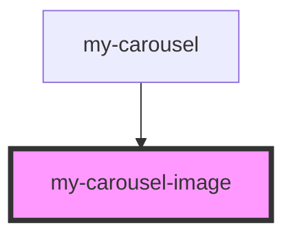

# my-carousel-image

<!-- Auto Generated Below -->

## Properties

| Property           | Attribute | Description | Type      | Default     |
| ------------------ | --------- | ----------- | --------- | ----------- |
| `active`           | `active`  |             | `boolean` | `undefined` |
| `alt` _(required)_ | `alt`     |             | `string`  | `undefined` |
| `src` _(required)_ | `src`     |             | `string`  | `undefined` |

## Events

| Event        | Description | Type                            |
| ------------ | ----------- | ------------------------------- |
| `imageClick` |             | `CustomEvent<{ src: string; }>` |

## Dependencies

### Used by

 - [my-carousel](.)

### Graph

----------------------------------------------

*Built with [StencilJS](https://stenciljs.com/)*
